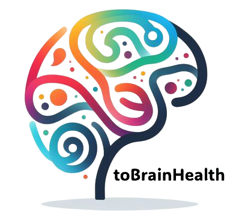

  

## About toBrainHealth

El uso de antibióticos es una práctica común en hospitales, pero la creciente resistencia antimicrobiana dificulta la selección de tratamientos eficaces. Para optimizar su uso, es fundamental contar con información actualizada sobre los patrones de sensibilidad de los microorganismos en cada centro hospitalario. Los Programas de Optimización del Uso de Antibióticos (PROA) han desarrollado estrategias para adaptar la terapia empírica a la realidad microbiológica de cada hospital, pero enfrentan dificultades en la obtención y actualización de datos clínico-microbiológicos.

Las infecciones asociadas a bacteriemia presentan una alta mortalidad y requieren un tratamiento empírico rápido y preciso. Sin embargo, los mapas microbiológicos tradicionales son difíciles de actualizar y poco accesibles para los médicos, lo que limita su uso. AppATB surge como una herramienta digital innovadora que permite acceder en tiempo real a información microbiológica y de sensibilidad antibiótica, facilitando la toma de decisiones clínicas.

La aplicación se basa en datos obtenidos automáticamente de cultivos sanguíneos hospitalarios, un procedimiento estándar en la mayoría de los centros. Su implementación permitirá mejorar la calidad de la prescripción antibiótica, reducir el uso de antibióticos de amplio espectro y minimizar la aparición de microorganismos multirresistentes. Además, la integración de tecnologías móviles y herramientas digitales en la gestión de infecciones hospitalarias facilitará la consulta de información actualizada y personalizada según el ecosistema microbiológico de cada hospital.

Este proyecto representa un avance significativo en la optimización del uso de antibióticos y en la lucha contra la resistencia antimicrobiana, proporcionando una herramienta eficaz y accesible para los equipos PROA y los médicos prescriptores.

## Our Objective

Desarrollar AppATB, una herramienta e-health innovadora que optimice la prescripción antimicrobiana en casos de bacteriemia, proporcionando recomendaciones personalizadas y actualizadas en tiempo real, adaptadas a la realidad clínica de cada paciente y centro hospitalario.

This project aims to achieve the following specific objectives:
+ <b>Mapa de resistencias antibióticas.</b>
Proporcionar una visión geográfica actualizada sobre la resistencia de los microorganismos a los antibióticos en distintos hospitales..
+  Optimización del tratamiento inicial.
Facilitar una prescripción más precisa y eficaz de antibióticos en infecciones graves, mejorando el tratamiento empírico desde el primer momento.
+ Mejor evolución de los pacientes.
Reducir complicaciones y mejorar la recuperación de los pacientes con bacteriemias mediante una terapia antibiótica más ajustada.
+ Reducción de microorganismos multirresistentes
Disminuir la aparición de bacterias resistentes a los antibióticos optimizando la selección del tratamiento antimicrobiano.
+ Uso racional de antibióticos
Minimizar el consumo innecesario de antibióticos y contribuir a una prescripción más responsable y basada en datos reales.
+ Experiencia y satisfacción de los profesionales
Evaluar la usabilidad, efectividad y aceptación de AppATB entre los médicos prescriptores y los equipos PROA en los hospitales participantes.

## Who We Are

AppATB es el resultado de un esfuerzo colaborativo entre expertos en bioingeniería, tecnología sanitaria y profesionales clínicos especializados en enfermedades infecciosas. Su desarrollo e implementación ha sido realizada por el Grupo de Bioingeniería y Telemedicina de la Universidad Politécnica de Madrid (GBT-UPM).

En el ámbito clínico, el proyecto cuenta con la participación de profesionales sanitarios de prestigiosos hospitales de España, quienes han aportado su experiencia y conocimientos para garantizar la eficacia y aplicabilidad de AppATB en la práctica médica. Entre los centros colaboradores se encuentran:

Parc Sanitari Sant Joan de Déu
Hospital Universitari de la Santa Creu i Sant Pau
Hospital Universitario Sant Joan
Hospital Universitari Arnau de Vilanova
Esta sinergia entre la tecnología y la medicina nos permite desarrollar una solución avanzada, adaptada a la realidad de cada centro hospitalario, con el objetivo de mejorar la prescripción antimicrobiana y optimizar el tratamiento de las bacteriemias.

## News and Publications

Stay updated with the latest developments in the field of brain health through our curated collection of news articles, research papers, and publications. Our commitment to scientific rigor ensures that the information you find here is reliable and up-to-date.

## Join the toBrainHealth Community

Join us in our pursuit of knowledge and better brain health. Together, we can contribute to a world where everyone has the tools and understanding to optimize brain function.

[Contact Us](mailto:info@tobrainhealth.es)
